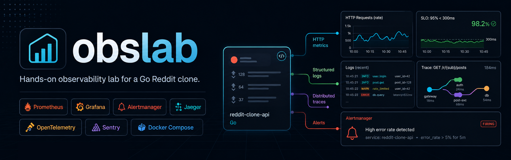
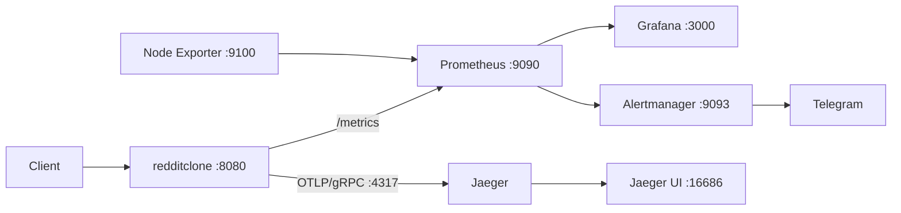

# obslab



`obslab` is a hands-on observability lab built around a Reddit clone written in Go.

The project demonstrates how application metrics, structured logs, distributed traces and alerting can be connected into a single monitoring stack using **Prometheus**, **Grafana**, **Alertmanager**, **Jaeger**, **OpenTelemetry** and **Sentry**.

The Reddit clone acts as an instrumented demo application: it exposes Prometheus metrics, propagates request and trace identifiers through logs, creates OpenTelemetry spans for HTTP and repository operations, and can export traces either to Jaeger or Sentry.

## What this project demonstrates

- HTTP application metrics with Prometheus;
- request latency histograms and percentile queries;
- metrics grouped by method, route and response status;
- structured application logging with Zap;
- request correlation through `X-Request-ID`;
- `trace_id` and `span_id` correlation in logs;
- distributed tracing with OpenTelemetry;
- trace export to Jaeger over OTLP/gRPC;
- host metrics with Node Exporter;
- dashboards and metric exploration in Grafana;
- Prometheus alerting rules;
- alert delivery through Alertmanager and Telegram;
- local deployment of the complete stack with Docker Compose.

## Observability stack

| Component | Purpose | Local address |
|---|---|---|
| Reddit clone | Instrumented demo application | `http://localhost:8080` |
| Prometheus metrics | Application metrics endpoint | `http://localhost:8080/metrics` |
| Prometheus | Metrics collection and querying | `http://localhost:9090` |
| Alertmanager | Alert routing and notifications | `http://localhost:9093` |
| Node Exporter | Host metrics | `http://localhost:9100/metrics` |
| Grafana | Metrics visualization | `http://localhost:3000` |
| Jaeger | Distributed tracing UI | `http://localhost:16686` |
| OTLP/gRPC | Trace ingestion | `localhost:4317` |
| OTLP/HTTP | Trace ingestion | `localhost:4318` |

## Architecture



## Service Level Objectives

The demo application uses the following latency objectives:

- **95%** of requests should complete within **50 ms**;
- **99%** of requests should complete within **100 ms**.

The request-duration histogram includes dedicated `0.05` and `0.1` second buckets, allowing these thresholds to be monitored directly with Prometheus and Grafana.

## Getting started

### Requirements

You only need:

- Docker;
- Docker Compose.

Clone the repository:

```bash
git clone https://github.com/Mimist-Illusionard/obslab.git
cd obslab
```

### 1. Start the Reddit clone

The application creates the shared `obslab_reddit-network` Docker network used by the monitoring services.

```bash
cd redditclone
docker compose up -d --build
cd ..
```

The application is available at:

```text
http://localhost:8080
```

Prometheus metrics are exposed at:

```text
http://localhost:8080/metrics
```

By default, the application uses Jaeger as the tracing backend:

```env
TRACE_BACKEND=jaeger
OTEL_SERVICE_NAME=redditclone
OTEL_EXPORTER_OTLP_ENDPOINT=jaeger:4317
```

### 2. Start Jaeger

```bash
cd jaeger
docker compose up -d
cd ..
```

Open the Jaeger UI:

```text
http://localhost:16686
```

Jaeger exposes the standard OpenTelemetry endpoints:

- OTLP/gRPC: `4317`;
- OTLP/HTTP: `4318`.

The Reddit clone sends traces to Jaeger through OTLP/gRPC.

### 3. Start Prometheus and Alertmanager

```bash
cd prometheus
docker compose up -d
cd ..
```

Open:

- Prometheus: `http://localhost:9090`;
- Alertmanager: `http://localhost:9093`;
- Node Exporter metrics: `http://localhost:9100/metrics`.

Prometheus scrapes:

- `reddit:8080` for application metrics;
- `node-exporter:9100` for host metrics.

The scrape interval and rule evaluation interval are both set to **10 seconds**.

### 4. Start Grafana

```bash
cd grafana
docker compose up -d
cd ..
```

Open Grafana:

```text
http://localhost:3000
```

Default local credentials:

```text
login: admin
password: admin
```

Add Prometheus as a Grafana data source using the internal Docker address:

```text
http://prometheus:9090
```

Grafana provisioning and exported dashboard JSON files are not included, so dashboards can be built manually from the metrics described below.

## Metrics

The application registers two custom Prometheus metrics.

### `http_requests_total`

Counter labels:

- `method`;
- `route`;
- `status`.

Request rate grouped by route and status:

```promql
sum by (route, status) (
  rate(http_requests_total[1m])
)
```

5xx response rate by route:

```promql
sum by (route) (
  rate(http_requests_total{status=~"5.."}[5m])
)
```

### `http_request_duration_seconds`

Histogram labels:

- `method`;
- `route`;
- `status`.

Configured buckets:

```text
5ms, 10ms, 25ms, 50ms, 100ms, 250ms, 500ms, 1s, 2.5s, 5s, 10s
```

p95 latency by route:

```promql
histogram_quantile(
  0.95,
  sum by (le, route) (
    rate(http_request_duration_seconds_bucket[5m])
  )
)
```

p99 latency by route:

```promql
histogram_quantile(
  0.99,
  sum by (le, route) (
    rate(http_request_duration_seconds_bucket[5m])
  )
)
```

These queries can be used in Grafana to compare observed latency with the configured SLO thresholds.

## Logging and correlation

Each incoming HTTP request receives a generated request ID. The value is also returned to the client in the response header:

```text
X-Request-ID
```

Application request logs contain correlation fields:

- `request_id`;
- `trace_id`;
- `span_id`.

Access logs also include the HTTP method, path, remote address, user agent, response status and request duration.

Log levels depend on the HTTP status code:

- `INFO` for successful responses;
- `WARN` for 4xx responses;
- `ERROR` for 5xx responses.

This makes it possible to follow one request from an application log entry to its OpenTelemetry trace.

## Distributed tracing

OpenTelemetry instrumentation is enabled for the Gorilla Mux router through `otelmux`.

The application also creates spans inside handlers and repositories. Examples include:

```text
PostHandler.List
PostHandler.Add
PostHandler.Get
PostHandler.Comment
UserHandler.Login
UserHandler.Register
PostMemoryRepository.Create
PostMemoryRepository.Get
PostMemoryRepository.Save
UserMemoryRepository.Login
UserMemoryRepository.Register
```

Errors and selected operation attributes are recorded on spans as well.

### Jaeger

The Jaeger environment is defined in `redditclone/.env.jaeger`:

```env
TRACE_BACKEND=jaeger
OTEL_SERVICE_NAME=redditclone
OTEL_EXPORTER_OTLP_ENDPOINT=jaeger:4317
```

The same values are provided as defaults by `redditclone/docker-compose.yml`.

### Sentry

To export tracing data to Sentry instead, configure:

```env
TRACE_BACKEND=sentry
OTEL_SERVICE_NAME=redditclone
SENTRY_DSN=<your-sentry-dsn>
SENTRY_ENVIRONMENT=development
```

Then start the application with the Sentry environment file:

```bash
cd redditclone
docker compose --env-file .env.sentry up -d --build
```

`SENTRY_DSN` is required when `TRACE_BACKEND=sentry` is selected.

## Alerting

Prometheus alerting rules are stored in:

```text
prometheus/data/alerts.yml
```

Prometheus forwards triggered alerts to Alertmanager at:

```text
alertmanager:9093
```

Alertmanager is configured with a Telegram receiver.

Telegram credentials are stored separately from the YAML configuration:

```text
prometheus/data/token.txt
prometheus/data/chat-id.txt
```

These files are excluded from version control and must be created locally before using Telegram notifications.

Expected mapping in `alertmanager.yml`:

```yaml
telegram_configs:
  - chat_id_file: /etc/alertmanager/chat-id.txt
    bot_token_file: /etc/alertmanager/token.txt
    send_resolved: true
```

## Project structure

```text
obslab/
├── grafana/
│   └── docker-compose.yml
├── jaeger/
│   └── docker-compose.yml
├── prometheus/
│   ├── docker-compose.yml
│   └── data/
│       ├── alertmanager.yml
│       ├── alerts.yml
│       ├── prometheus.yml
│       ├── chat-id.txt
│       └── token.txt
├── redditclone/
│   ├── cmd/redditclone/
│   ├── internal/
│   │   ├── handlers/
│   │   ├── logs/
│   │   ├── metrics/
│   │   ├── middleware/
│   │   ├── repository/
│   │   └── trace/
│   ├── static/
│   ├── .env.jaeger
│   ├── .env.sentry
│   ├── Dockerfile
│   └── docker-compose.yml
└── task.md
```